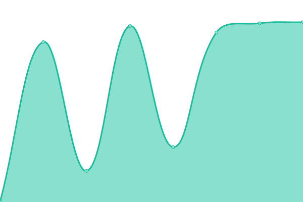

# [📈 Live Status](https://status.cybotrade.rs): <!--live status--> **🟧 Partial outage**

This repository contains the open-source uptime monitor and status page for [Upptime](https://upptime.js.org), powered by [Upptime](https://github.com/upptime/upptime).

With [Upptime](https://upptime.js.org), you can get your own unlimited and free uptime monitor and status page, powered entirely by a GitHub repository. We use [Issues](https://github.com/upptime/upptime/issues) as incident reports, [Actions](https://github.com/cybotrade/status/actions) as uptime monitors, and [Pages](https://status.cybotrade.rs) for the status page.

<!--start: status pages-->
<!-- This summary is generated by Upptime (https://github.com/upptime/upptime) -->
<!-- Do not edit this manually, your changes will be overwritten -->
<!-- prettier-ignore -->
| URL | Status | History | Response Time | Uptime |
| --- | ------ | ------- | ------------- | ------ |
|  [Cybotrade](https://app.cybotrade.rs) | 🟥 Down | [cybotrade.yml](https://github.com/cybotrade/status/commits/HEAD/history/cybotrade.yml) | 

 0ms
     
 | 

<a href="https://status.cybotrade.rs/history/cybotrade">0.00%</a>
    

|  [Cybotrade Docs](https://docs.cybotrade.rs) | 🟩 Up | [cybotrade-docs.yml](https://github.com/cybotrade/status/commits/HEAD/history/cybotrade-docs.yml) | 

 756ms
     
 | 

<a href="https://status.cybotrade.rs/history/cybotrade-docs">99.82%</a>
    

<!--end: status pages-->

[**Visit our status website →**](https://status.cybotrade.rs)

## 📄 License

- Powered by: [Upptime](https://github.com/upptime/upptime)
- Code: [MIT](./LICENSE) © [Upptime](https://upptime.js.org)
- Data in the `./history` directory: [Open Database License](https://opendatacommons.org/licenses/odbl/1-0/)
